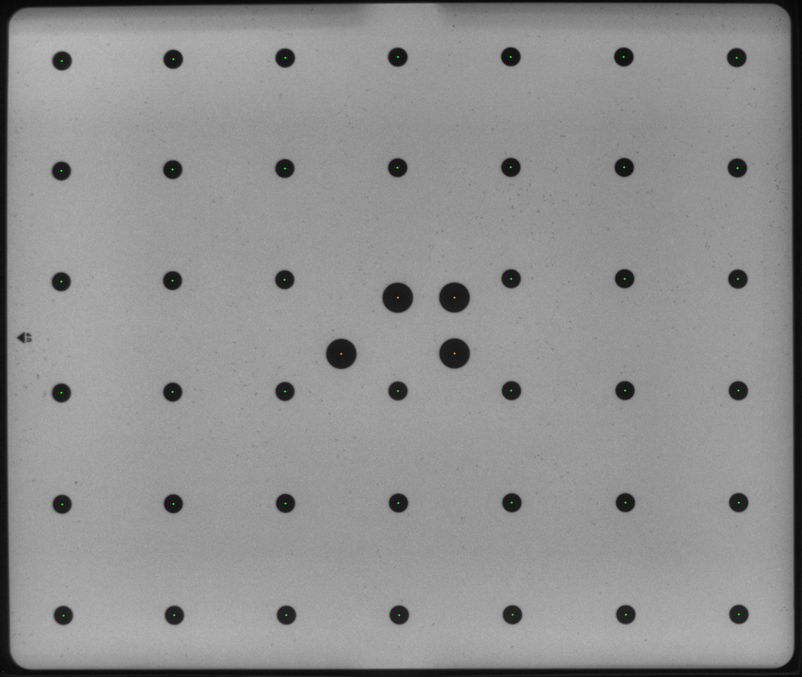
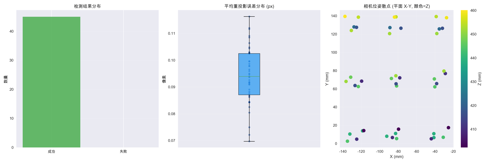
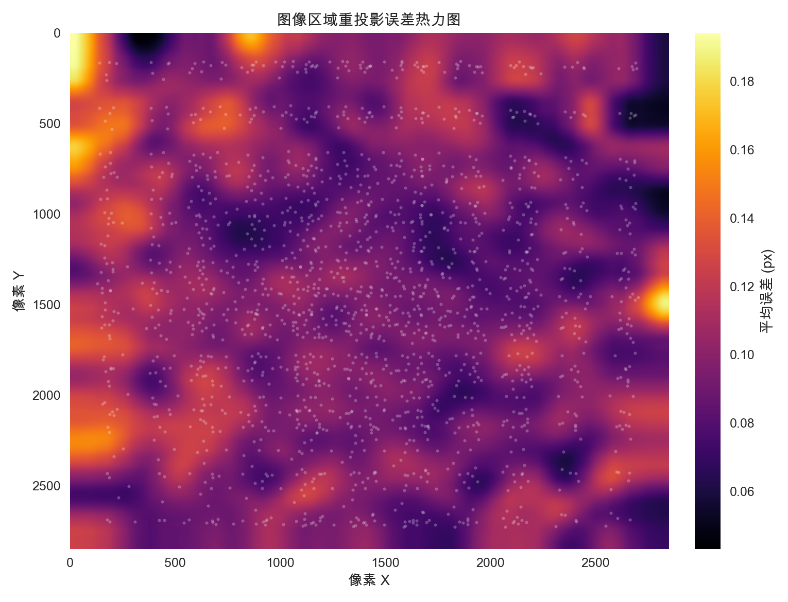
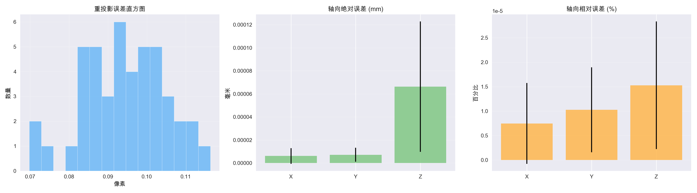

# Calib

相机标定与圆形标定板检测工具集。核心算法都封装在 `calib` 包内，其余脚本根据用途划分到 `tools/` 与 `tests/` 目录，便于在命令行环境中完成标定、评估与数据增强等任务。

## 目录结构

```
Calib/
├─ calib/                      # 核心检测与可视化模块（保持原有包结构）
├─ ref/                        # 标定板参考资料、截图与测量数据
├─ docs/
│  └─ (空)                      # 预留文档目录
├─ tests/
│  ├─ debug_quad_detection.py   # 调试四点检测的辅助脚本
│  └─ test_utils_smoke.py       # 共享工具的最小化单元测试
├─ tools/
│  ├─ augmentation/
│  │  └─ data_aug.py            # 多场景数据增强（原 data_aug.py 已保留兼容包装）
│  ├─ calibration/
│  │  ├─ calibrate_intrinsics.py      # 改进版相机内参标定主流程
│  │  └─ analyze_calibration.py       # 标定结果分析
│  ├─ cli/
│  │  └─ run_calib.py           # CLI 版标定流程
│  ├─ evaluation/
│  │  ├─ evaluate_board.py            # 综合检测/标定评估入口
│  │  └─ generate_visuals.py          # 标定质量可视化生成
│  ├─ analyze_calibration.py          # 兼容入口 → calibration/analyze_calibration.py
│  ├─ board_and_circle_finder_v31.py  # 历史独立检测脚本（计划逐步迁移）
│  ├─ calib_intrinsics.py             # 早期标定流程（保留以供参考）
│  ├─ calib_intrinsics_improved.py    # 兼容入口 → calibration/calibrate_intrinsics.py
│  ├─ data_aug.py                     # 兼容入口 → augmentation/data_aug.py
│  ├─ evaluate_board_calibration.py   # 兼容入口 → evaluation/evaluate_board.py
│  └─ generate_calibration_visuals.py # 兼容入口 → evaluation/generate_visuals.py
└─ environment.yml              # Conda 环境定义
```

## 常用脚本

| 脚本 | 功能 | 典型输入参数 | 典型输出位置 |
| --- | --- | --- | --- |
| `tools/augmentation/data_aug.py` | 生成多场景增强数据（保留 `tools/data_aug.py` 兼容入口） | `--input-dir /path/to/raw_images` | `--output-dir /path/to/augmented` |
| `tools/calibration/calibrate_intrinsics.py` | 多阶段高质量相机标定（保留旧入口） | `--input /path/to/calib_images` | `--output /path/to/calib_results` |
| `tools/calibration/analyze_calibration.py` | 对标定结果进行深入分析 | `--result /path/to/camera_calibration.json` | 终端输出 |
| `tools/evaluation/evaluate_board.py` | 检测成功率、重投影与位姿评估 | `--images /path/to/calib_images` | `--output /path/to/report_dir` |
| `tools/evaluation/generate_visuals.py` | 生成板覆盖度 / 重投影误差等可视化 | `--calibration-json /path/to/camera_calibration.json` | `--output /path/to/visuals_dir` |
| `tools/board_and_circle_finder_v31.py` | 历史独立检测与可视化脚本 | `--indir /path/to/images` | `--outdir /path/to/debug_dir` |

所有脚本都可以通过命令行参数覆盖默认输入/输出路径，满足更多实验需求。

## 检测参数调优

- 核心检测与编号的所有可调参数统一集中在 `calib/core/calib_core.py` 顶部的 `DetectionConfig` 数据类中；`DEFAULT_CONFIG` 完整复刻当前生产流程的默认数值。
- 当需要更高的召回率时，可以直接使用 `HIGH_RECALL_CONFIG` 预设：

    ```python
    from calib.core import Calibrator, HIGH_RECALL_CONFIG

    calibrator = Calibrator(config=HIGH_RECALL_CONFIG)
    result = calibrator.process_gray(gray_image)
    ```

    该预设会更积极地外扩四边形、放宽 Hough 线段与面积筛选阈值，并调整圆检测面积范围，以提升困难样本的成功率。

- 如果需要更细粒度地试验参数，可通过 `create_detection_config` 快速拷贝默认配置并覆写少量字段：

    ```python
    from calib.core import create_detection_config, Calibrator

    tuned_cfg = create_detection_config(blob_min_area=300.0, blob_max_area=32000.0)
    calibrator = Calibrator(config=tuned_cfg)
    ```

- 项目内所有使用 `Calibrator()` 的脚本都保持向后兼容，如需替换配置，可在实例化时显式传入 `config=` 参数。稍后会考虑把可选预设暴露为 CLI 选项，便于批量评估。

## 快速开始

```bash
# 0. 将项目根目录加入 PYTHONPATH，保证可以直接导入 calib 包
export PYTHONPATH=$(pwd)

# 1. 生成增强数据集（需自备原始图像）
python tools/augmentation/data_aug.py --input-dir /path/to/raw_images --output-dir /path/to/augmented

# 2. 使用改进版流程执行标定
python tools/calibration/calibrate_intrinsics.py --input /path/to/calib_images --output /path/to/calib_results --save_viz

# 3. 分析标定质量
python tools/calibration/analyze_calibration.py --result /path/to/calib_results/camera_calibration_improved.json

# 4. 生成检测与标定评估报告
python tools/evaluation/evaluate_board.py --images /path/to/calib_images --calibration /path/to/calib_results/camera_calibration_improved.json --output /path/to/report_dir --save_viz
```

## 数据集获取与验证

- 示例数据集（`calib_45`）已开放下载：<https://drive.google.com/drive/folders/1zHoPr-e2-I7DZpHDhPk-V5t5pPHO4Lic?usp=share_link>
- 运行环境：macOS + Conda (Python 3.10，OpenCV 按 `environment.yml` 安装)

如需在本地快速体验，可以先把压缩包下载到数据根目录并解压，然后运行以下流程完成标定并生成可视化结果（已于 2025-10-05 验证）：

```bash
cd /path/to/Calib
export PYTHONPATH=$(pwd)
python tools/calibration/calibrate_intrinsics.py \
    --input /path/to/datasets/calib_45 \
    --output outputs/calibration/calib_45 \
    --save_viz
```

运行结束后，标定参数写入 `outputs/calibration/calib_45/camera_calibration_improved.json`，同时生成对应的可视化 PNG 文件，可确认流程在外部数据目录下完全可用。

## ref 目录资源说明

- `ref/nolabel.png`（文档内记作 `board_reference.png`）与 `ref/size.jpg`（文档内记作 `board_with_scale.jpg`）均拍摄自 Creality 的 *High-Precision Calibration Board for Otter Serise / Ferret Serise*（产品链接：<https://store.creality.com/products/high-precision-calibration-board-for-otter-serise-ferret-serise>）。官方并未提供圆网格的标准坐标文件，因此仓库内的圆心位置数据是通过图像处理自动提取并人工校验得到。
- 标定板上四个大圆仅用于粗定位与姿态初始化，最终的几何求解依赖 41 个小圆的亚像素位置；相关权重配置可在 `calib/core/board_spec.py` 与 `calib/utils/board.py` 中查阅。
- 精确测量信息集中在 `ref/calib_board/` 目录，包含 `board_points.csv` / `board_points.json` / `board_points.svg` / `board_points.png` 等文件，分别提供数值版、可视化版与分享给第三方的辅助材料。如需在报告中引用，可将其视作官方资料的补充。

## Benchmark（calib_45 数据集）

| 项目 | 内容 |
| --- | --- |
| 数据来源 | `/path/to/datasets/calib_45` |
| 图像数量 | 45 张（全部通过质量检查） |
| 有效图像数 | 45 张参与最终求解 |
| 分辨率 | 2848 × 2848 |
| 重投影误差 | 0.0950 像素 |
| 畸变趋势 | 径向中等、切向极小 |
| 运行命令 | 见“外部数据目录验证”示例 |
| 轴向位移估计 (mm) | ΔX=0.000002±0.000010，ΔY=-0.000006±0.000011，ΔZ=-0.000023±0.000099 |
| 轴向物理误差均值 (mm) | X=0.000007，Y=0.000009，Z=0.000079 |
| 轴向物理误差相对 (%) | X=0.000010，Y=0.000014，Z=0.000018 |

### 推荐展示图片

启用 `--save_viz` 后，输出目录会生成以下关键图像，可使用示例代码批量筛选：

```python
from pathlib import Path
import shutil

viz_dir = Path("outputs/calibration/calib_45")
dest_dir = Path("report_assets")
dest_dir.mkdir(exist_ok=True)

patterns = {
    "detect": "*_detect.png",
    "undistort": "*_undistort.png",
    "reproj": "*_reproj.png",
}

for name, pattern in patterns.items():
    candidates = sorted(viz_dir.glob(pattern))
    if not candidates:
        continue
    chosen = candidates[0]  # 可根据需要调整索引
    target = dest_dir / f"calib45_{name}.png"
    shutil.copy(chosen, target)
    print(f"复制 {chosen.name} -> {target}")
```

这样能够直观呈现检测质量、畸变矫正效果与误差结构。

### 示例可视化（calib_45）

| 原始采集 | 板面展开 | 圆心编号 |
| --- | --- | --- |
|  |  |  |

> 上述截图直接来自 `outputs/calibration/calib_45/`，如需在其他数据集上展示，可参考同名模式（`*_raw.png`、`*_rect_refined.png`、`*_raw_numbered.png`）挑选对应阶段的可视化结果。

### Benchmark 视觉摘要

| 检测回顾 | 重投影误差热力图 | 位姿误差分解 |
| --- | --- | --- |
|  |  |  |

> `outputs/calibration/calib_45/report/` 中还包含完整的评估图表（如 `per_image_reprojection.png`、`translation_axis_offsets.png`），以及 `visualizations/` 目录下的逐图可视化。需要在 Benchmark 章节展示更多结果时，可直接引用这些文件或嵌入 Markdown 表格。

> 评估脚本会额外生成 `outputs/calibration/calib_45/report/axis_error_log.json`，记录每张图片的重投影残差拟合位移（单位 mm）以及对应的轴向相对误差。该日志与表格中数值一致，可用于追溯原始物理误差。  
> 轴向位移的计算方式：将每张图像的重投影残差投影回三维，利用像素误差对平移向量的一阶雅可比近似解出最小二乘位移，从而得到以毫米为单位的物理校准偏差。 

## 标定 Pipeline 详解

1. **数据加载与预处理**
   - 使用 `calib.utils.images.read_image_robust` 以灰度形式读取图像，自动处理异常像素深度与格式。
   - 内建 CLAHE、滤波及白片检测逻辑，保证在不同曝光/噪声条件下获得稳定输入。
2. **标定板定位与展开**
   - `Calibrator` 通过 Hough 线、四边形评分和外扩策略定位标定板边界。
   - 采用透视变换将板面展开到统一尺度，为后续圆检测提供一致分辨率。
3. **圆心检测与编号**
   - 结合自适应 Blob 检测、亚像素扩展与拓扑筛选，识别 41 个小圆与 4 个大圆。
   - 借助网格拓扑与大圆基准完成自动编号，输出 `BoardResult` 数据结构。
4. **质量检查与筛选**
   - `analyze_detection_quality` 检查圆数量、分布范围与四角大圆的完整性。
   - 对检测失败、质量不足的图像进行日志记录并从标定候选集中剔除。
5. **物理点构建**
   - `create_circle_board_object_points_adaptive` 根据 `BoardSpec` 生成真实世界坐标，与像素点按编号一一匹配。
   - 支持修改圆心距、圆直径等参数，以适配不同规格的标定板。
6. **多阶段标定求解**
   - `perform_multi_stage_calibration` 先以全量图像求解，再基于重投影误差挑选高质量子集复算，提高鲁棒性。
   - 输出内参矩阵、畸变系数、使用图像数量及最终重投影误差。
7. **结果分析与可视化**
   - `analyze_calibration_quality` 打印焦距、主点、视场角与畸变分析，给出应用建议。
   - `Visualizer` 按需生成检测叠加、矫正对比与重投影误差可视化，为报告和调试提供素材。

## 正确的评估流程

1. 准备标定结果：确认 `camera_calibration_improved.json` 已生成。
2. 运行综合评估：

   ```bash
   cd /path/to/Calib
   export PYTHONPATH=$(pwd)
   python tools/evaluation/evaluate_board.py \
         --images /path/to/calib_images \
         --calibration /path/to/calib_results/camera_calibration_improved.json \
         --output /path/to/report_dir \
         --save_viz
   ```

3. 解读输出：`report_dir` 内包含召回率、重投影统计、位姿误差及对应可视化；如需更细节，可再运行 `tools/evaluation/generate_visuals.py`。
4. 文本报告（可选）：执行 `python tools/calibration/analyze_calibration.py --result <json>` 获取终端友好的评价摘要。

## 数据集发布建议

1. **打包**：在数据集根目录执行 `tar -czf calib_45.tar.gz calib_45/`，保持目录中直接存放原始图像。
2. **校验**：运行 `shasum -a 256 calib_45.tar.gz`（或 `sha256sum`）并记录结果，发布在 README 与分享页面。
3. **上传**：将压缩包上传至 Google Drive，设置“拥有链接的用户可查看”，并获取共享链接（同时可以生成直接下载的 `uc?export=download&id=` 形式）。
4. **下载指引**：在仓库 README 中提供推荐命令，例如：

   ```bash
   pip install gdown
   gdown "https://drive.google.com/uc?export=download&id=<FILE_ID>" -O calib_45.tar.gz
   tar -xzf calib_45.tar.gz -C /path/to/datasets
   ```

5. **附加说明**：在数据发布页补充拍摄设备、板规格、曝光设置等元信息，帮助他人理解数据来源；若有多个序列，建议以 `calib_<session>/` 命名并维护版本号。

## 最小调用示例

以下示例展示了从检测到生成标定结果的完整最小流程，并打印关键内参，便于快速验证：

```python
from pathlib import Path
import json

import cv2
import numpy as np

from calib.core.calib_core import Calibrator
from calib.core.board_spec import DEFAULT_BOARD_SPEC
from calib.utils.board import (
    create_circle_board_object_points_adaptive,
    extract_image_points_ordered,
)
from calib.utils.images import read_image_robust

calibrator = Calibrator()
image_dir = Path("/path/to/datasets/calib_45")

object_points_list = []
image_points_list = []
image_size = None

for image_path in sorted(image_dir.glob("*.png")):
    gray = read_image_robust(str(image_path))
    if gray is None:
        continue

    board = calibrator.process_gray(gray)
    if not (board and board.small_numbered):
        continue

    image_points = extract_image_points_ordered(board)
    object_points = create_circle_board_object_points_adaptive(
        len(image_points), spacing=DEFAULT_BOARD_SPEC.center_spacing_mm
    )

    object_points_list.append(object_points)
    image_points_list.append(image_points)

    if image_size is None:
        image_size = (gray.shape[1], gray.shape[0])

if len(image_points_list) < 5:
    raise RuntimeError("有效图像不足，至少需要 5 张才能完成标定")

ret, camera_matrix, dist_coeffs, _, _ = cv2.calibrateCamera(
    object_points_list,
    image_points_list,
    image_size,
    None,
    None,
)

calib_result = {
    "success": bool(ret),
    "camera_matrix": camera_matrix.tolist(),
    "distortion_coefficients": dist_coeffs.flatten().tolist(),
    "image_size": image_size,
}

output_path = Path("./camera_calibration_minimal.json")
output_path.write_text(json.dumps(calib_result, indent=2))

K = np.array(calib_result["camera_matrix"])
print("标定完成，结果写入", output_path)
print("fx =", K[0, 0], "fy =", K[1, 1], "cx =", K[0, 2], "cy =", K[1, 2])
```

该脚本生成的 JSON 与 `tools/calibration/calibrate_intrinsics.py` 输出结构兼容，可直接配合评估与可视化脚本继续后续流程。

## 测试

```bash
pytest
```

上述指令会运行 `tests/test_utils_smoke.py` 中的单元测试，快速验证共享工具函数工作正常。若需要进一步评估检测流程，可使用自备数据执行：

```bash
python tools/evaluation/evaluate_board.py --images /path/to/calib_images --output /path/to/report_dir --calibration /path/to/calib_results/camera_calibration_improved.json
```

## 备注

- 所有脚本在执行时会自动定位项目根目录，因此可以直接从仓库根目录运行。
- 建议使用提供的 `environment.yml` 创建 Conda 环境，以获得完整的依赖。