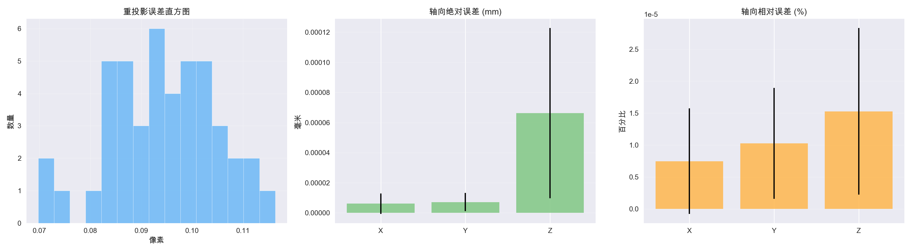

# 检测与标定评估报告

## 检测表现
- 总图片数: 45
- 成功: 45 | 失败: 0
- 成功率: 100.0%
- 耗时统计 (ms): 平均 246.79, 最快 215.61, 最慢 356.17

## 标定板参数
- 小圆直径: 5.00 mm
- 小圆半径: 2.50 mm
- 圆心间距: 25.00 mm

### 检测参数配置
- 预设: `default`
- 覆盖参数: 无

## 可视化概览

## 异常样本筛选
- 初始成功样本数: 45
- 剩余样本数: 45
- 剔除数量: 0
- 迭代轮数: 1
- 最终平均误差阈值: 0.12 px
- 最终单点误差阈值: 45.00 px

## 样本重投影误差分布
### 剩余样本中重投影最高 TOP5
| 图像 | 平均 (px) | 最大 (px) | 中位数 (px) | 标准差 (px) |
| --- | --- | --- | --- | --- |
| 37_0_raw | 0.116 | 0.222 | 0.094 | 0.054 |
| 44_0_raw | 0.112 | 0.243 | 0.107 | 0.054 |
| 17_0_raw | 0.112 | 0.323 | 0.103 | 0.054 |
| 40_0_raw | 0.109 | 0.186 | 0.100 | 0.047 |
| 25_0_raw | 0.108 | 0.207 | 0.108 | 0.047 |

## 标定精度分析
- 有效样本数: 45
- 平均重投影误差: 0.095 px
- 中位数重投影误差: 0.091 px
- 最坏重投影误差: 0.323 px
- 重投影标准差 (均值): 0.046 px
- 平均相对位姿 (mm): X=-74.9±38.0, Y=68.7±49.8, Z=435.3±18.3
- 平均姿态 (deg): roll=-1.8±9.5, pitch=6.9±8.7, yaw=-89.7±1.2
- 轴向位移估计 (mm): ΔX=0.00±0.00, ΔY=-0.00±0.00, ΔZ=-0.00±0.00
- 轴向绝对误差均值 (mm): X=0.00±0.00, Y=0.00±0.00, Z=0.00±0.00
- 轴向相对误差均值 (%): X=0.00±0.00, Y=0.00±0.00, Z=0.00±0.00

## 抽样详情
| 图像 | 重投影均值 (px) | 重投影最大 (px) | 位姿 (mm) | 姿态 (deg) | 轴向位移估计 (mm) | 绝对误差 (mm) | 相对误差 (%) |
| --- | --- | --- | --- | --- | --- | --- | --- |
| 42_0_raw | 0.092 | 0.174 | (-33.1, 69.9, 446.5) | (-17.2, 6.5, -91.3) | (-0.00, 0.00, -0.00) | (0.00, 0.00, 0.00) | (0.00, 0.00, 0.00) |
| 15_0_raw | 0.096 | 0.235 | (-32.6, 61.2, 445.3) | (-1.7, 20.7, -90.5) | (-0.00, 0.00, 0.00) | (0.00, 0.00, 0.00) | (0.00, 0.00, 0.00) |
| 6_0_raw | 0.095 | 0.171 | (-22.6, 78.5, 452.3) | (-1.5, 6.8, -89.9) | (-0.00, -0.00, -0.00) | (0.00, 0.00, 0.00) | (0.00, 0.00, 0.00) |
| 38_0_raw | 0.102 | 0.208 | (-85.0, 7.0, 440.6) | (-16.4, 6.7, -87.9) | (0.00, 0.00, -0.00) | (0.00, 0.00, 0.00) | (0.00, 0.00, 0.00) |
| 20_0_raw | 0.091 | 0.320 | (-79.3, 5.7, 411.0) | (-1.5, -6.4, -89.1) | (-0.00, -0.00, 0.00) | (0.00, 0.00, 0.00) | (0.00, 0.00, 0.00) |

## 交叉验证与鲁棒标定
- 折数: 5
- 交叉验证平均重投影误差: 0.096 px
- 交叉验证最大误差: 0.336 px

| Fold | 训练样本 | 验证样本 | 均值 (px) | 中位数 (px) | 最大 (px) |
| --- | --- | --- | --- | --- | --- |
| 1 | 36 | 9 | 0.096 | 0.092 | 0.335 |
| 2 | 36 | 9 | 0.098 | 0.091 | 0.251 |
| 3 | 36 | 9 | 0.093 | 0.087 | 0.238 |
| 4 | 36 | 9 | 0.094 | 0.091 | 0.243 |
| 5 | 36 | 9 | 0.099 | 0.095 | 0.336 |

### 全量鲁棒标定统计
- 样本数: 45
- 平均重投影误差: 0.094 px
- 中位数重投影误差: 0.090 px
- 最坏重投影误差: 0.335 px
- 平均位姿 (mm): X=-82.1±38.0, Y=69.7±49.8, Z=434.0±18.3
- 平均姿态 (deg): roll=-0.8±9.5, pitch=6.7±8.7, yaw=-89.6±1.2
- 轴向位移估计 (mm): ΔX=-0.00±0.00, ΔY=-0.00±0.00, ΔZ=-0.00±0.00
- 轴向绝对误差均值 (mm): X=0.00±0.00, Y=0.00±0.00, Z=0.00±0.00
- 轴向相对误差均值 (%): X=0.00±0.00, Y=0.00±0.00, Z=0.00±0.00

### 鲁棒标定抽样
| 图像 | 重投影均值 (px) | 重投影最大 (px) | 位姿 (mm) | 姿态 (deg) | 轴向位移估计 (mm) | 绝对误差 (mm) | 相对误差 (%) |
| --- | --- | --- | --- | --- | --- | --- | --- |
| 10_0_raw | 0.098 | 0.185 | (-118.6, 13.9, 439.2) | (-0.6, 21.9, -89.9) | (0.00, -0.00, 0.00) | (0.00, 0.00, 0.00) | (0.00, 0.00, 0.00) |
| 11_0_raw | 0.091 | 0.205 | (-82.6, 11.0, 438.6) | (-0.6, 21.7, -89.6) | (-0.00, -0.00, 0.00) | (0.00, 0.00, 0.00) | (0.00, 0.00, 0.00) |
| 12_0_raw | 0.088 | 0.167 | (-41.0, 6.5, 437.7) | (-0.7, 21.6, -90.1) | (-0.00, 0.00, 0.00) | (0.00, 0.00, 0.00) | (0.00, 0.00, 0.00) |
| 13_0_raw | 0.099 | 0.176 | (-123.2, 62.5, 445.6) | (-0.6, 20.7, -89.3) | (-0.00, 0.00, 0.00) | (0.00, 0.00, 0.00) | (0.00, 0.00, 0.00) |
| 14_0_raw | 0.088 | 0.210 | (-81.5, 63.2, 445.2) | (-0.7, 20.6, -90.3) | (-0.00, -0.00, -0.00) | (0.00, 0.00, 0.00) | (0.00, 0.00, 0.00) |
| 15_0_raw | 0.095 | 0.231 | (-40.0, 62.2, 444.6) | (-0.7, 20.6, -90.1) | (-0.00, 0.00, -0.00) | (0.00, 0.00, 0.00) | (0.00, 0.00, 0.00) |
| 16_0_raw | 0.097 | 0.204 | (-123.1, 138.6, 454.7) | (-0.7, 20.4, -90.5) | (-0.00, 0.00, 0.00) | (0.00, 0.00, 0.00) | (0.00, 0.00, 0.00) |
| 17_0_raw | 0.112 | 0.323 | (-82.1, 138.9, 454.3) | (-0.7, 20.0, -90.8) | (-0.00, -0.00, -0.00) | (0.00, 0.00, 0.00) | (0.00, 0.00, 0.00) |
| 18_0_raw | 0.105 | 0.197 | (-38.5, 139.2, 453.9) | (-0.6, 19.7, -90.2) | (-0.00, -0.00, -0.00) | (0.00, 0.00, 0.00) | (0.00, 0.00, 0.00) |
| 19_0_raw | 0.086 | 0.201 | (-124.9, 4.8, 410.6) | (-0.6, -6.3, -89.3) | (-0.00, -0.00, 0.00) | (0.00, 0.00, 0.00) | (0.00, 0.00, 0.00) |
| ... | | | | | | | 剩余 35 个样本略 |